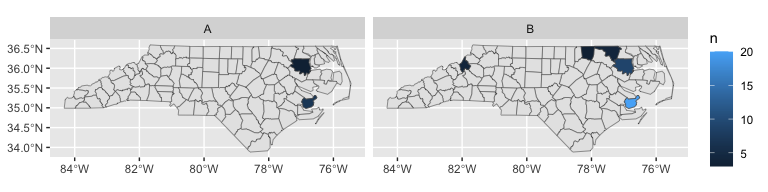

<!-- README.md is generated from README.Rmd. Please edit that file -->

# cartographer

<!-- badges: start -->

[](https://cidm-ph.r-universe.dev)
<!-- badges: end -->

Cartographer makes it easy to visualise your data on a map when you have
a column in the data that names a place/region. The map data itself is
provided by other packages or your own code.

## Installation

You can install cartographer like so:

``` r
options(repos = c(
  cidmph = 'https://cidm-ph.r-universe.dev',
  CRAN = 'https://cloud.r-project.org'))
  
install.packages('cartographer')
```

## Map data

Packages can register map data with cartographer:

- `{nswgeo}` - map data of New South Wales, Australia.

Alternatively, you can either register your own data using
`register_map()`.

## Example

Cartographer comes with one example dataset registered (the map of North
Carolina provided by the `{sf}` package where the feature names
correspond to counties).

``` r
library(cartographer)

# list registered datasets
feature_types()
#> [1] "sf.nc"

# list feature names in one of the datasets
head(feature_names("sf.nc"))
#> [1] "Ashe"        "Alleghany"   "Surry"       "Currituck"   "Northampton"
#> [6] "Hertford"
```

Our example dataset has a column called `county` with the name of the
county and a column `type` that is one of two values. We’d like to draw
a map that shows us where the entries are by type.

``` r
head(nc_type_example_1)
#>    county type
#> 1  BERTIE    B
#> 2  BERTIE    A
#> 3  BERTIE    A
#> 4 PAMLICO    B
#> 5  WARREN    B
#> 6 PAMLICO    B
```

We want to convert our data frame into a spatial data frame, then we’ll
be able to use standard `{ggplot2}` tools to draw our map. Cartographer
just needs to know which of its maps we’re using (`"sf.nc"`, although
it’s able to guess that if we don’t specify it), and which column has
the feature names (`county`):

``` r
add_geometry(nc_type_example_1, county, feature_type = "sf.nc")
#> Error in `resolve_feature_names()`:
#> ! location contains unexpected values
#> ✖ The unknown values are PAMILCO.
#> ℹ Expected sf.nc names like Ashe, Alleghany, and Surry.
#> ℹ See feature_names('sf.nc') for the full list.
```

What happened? The matching of county names was case-insensitive, so
that wasn’t the issue; it looks like our data contained a typo. One of
the rows contains `"PAMILCO"` instead of `"PAMLICO"` in the `county`
column.

``` r
library(dplyr, warn.conflicts = FALSE)

# cleaned dataset
nc_type_example_1_fixed <-
  nc_type_example_1 |>
  mutate(county = case_match(county, "PAMILCO" ~ "PAMLICO", .default = county))

add_geometry(nc_type_example_1_fixed, county, feature_type = "sf.nc")
#> Simple feature collection with 50 features and 2 fields
#> Geometry type: MULTIPOLYGON
#> Dimension:     XY
#> Bounding box:  xmin: -82.07776 ymin: 34.98222 xmax: -76.50713 ymax: 36.55629
#> Geodetic CRS:  NAD27
#> First 10 features:
#>         county type                       geometry
#> 1       BERTIE    B MULTIPOLYGON (((-76.78307 3...
#> 2       BERTIE    A MULTIPOLYGON (((-76.78307 3...
#> 3       BERTIE    A MULTIPOLYGON (((-76.78307 3...
#> 4      PAMLICO    B MULTIPOLYGON (((-76.94324 3...
#> 5       WARREN    B MULTIPOLYGON (((-78.30876 3...
#> 6      PAMLICO    B MULTIPOLYGON (((-76.94324 3...
#> 7  NORTHAMPTON    B MULTIPOLYGON (((-77.21767 3...
#> 8      PAMLICO    A MULTIPOLYGON (((-76.94324 3...
#> 9      PAMLICO    B MULTIPOLYGON (((-76.94324 3...
#> 10     PAMLICO    B MULTIPOLYGON (((-76.94324 3...
```

Now that we have our spatial geometry added, we can go ahead and plot
it, adding a layer that uses the full `"sf.nc"` dataset to give us the
base map:

``` r
library(ggplot2)

nc_type_example_1_fixed |>
  count(county, type) |>
  add_geometry(county, feature_type = "sf.nc") |>
  ggplot() +
  geom_sf(data = map_sf("sf.nc")) +
  geom_sf(aes(fill = n)) +
  facet_wrap(vars(type))
```



The package `{ggautomap}` uses cartographer to provide some new geoms
that transparently attach the map data and perform some calculations
like mapping our data to the middle or random points within the
corresponding feature.
